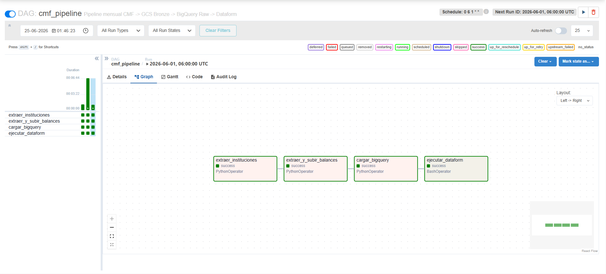
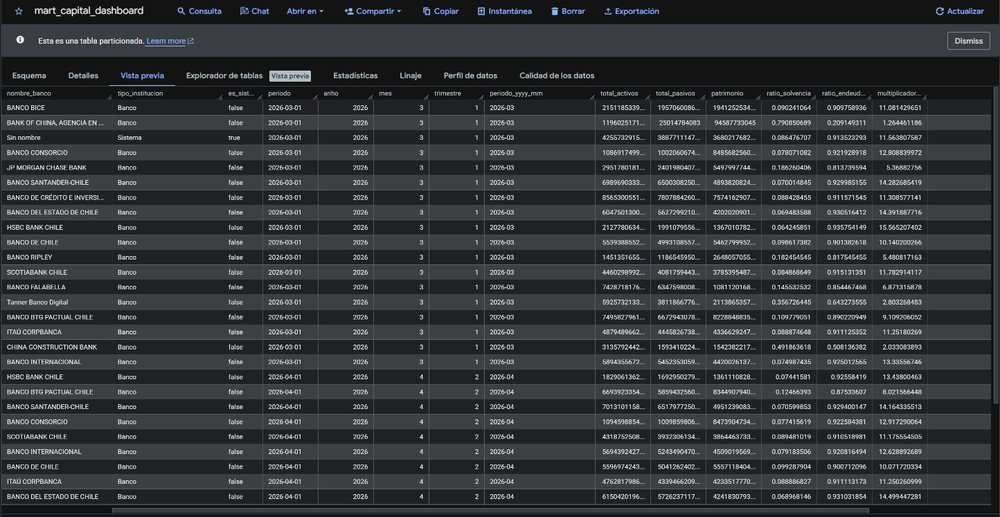
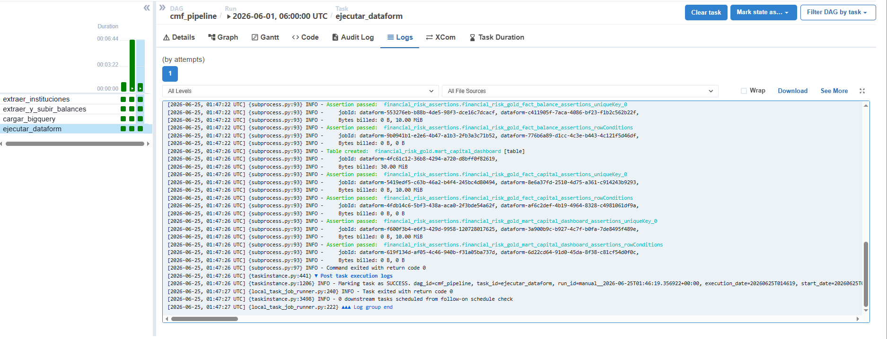
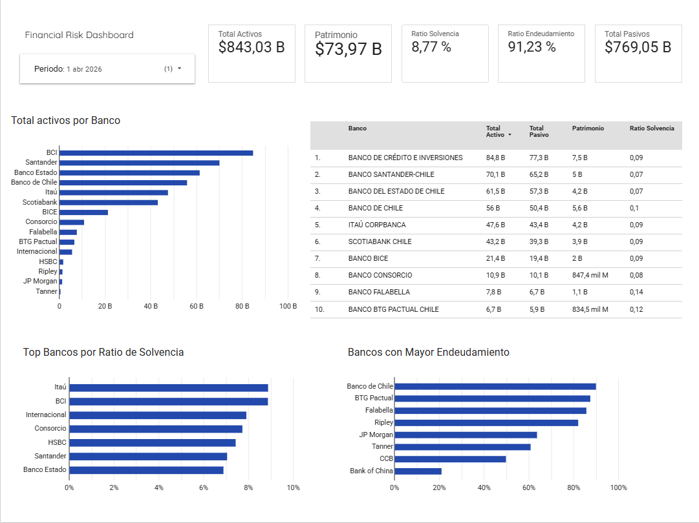

# Financial Risk Data Platform

Proyecto de portafolio de ingenieria de datos enfocado en riesgo financiero bancario en Chile. Construye un pipeline ELT que extrae informacion publica desde la API de la CMF, la almacena en Google Cloud Storage, la carga a BigQuery, la transforma con Dataform y deja una capa Gold lista para analisis en Looker Studio.

El objetivo de este proyecto es demostrar habilidades practicas para un primer rol en datos: integracion con APIs, orquestacion, modelado analitico, automatizacion cloud, buenas practicas de seguridad y documentacion tecnica clara.

## Resumen Para Reclutadores

- **Problema:** los datos financieros bancarios de la CMF estan disponibles publicamente, pero requieren extraccion, limpieza, normalizacion y modelado para ser utiles en analisis.
- **Solucion:** pipeline automatizado que transforma balances bancarios mensuales en tablas analiticas para monitorear activos, pasivos, patrimonio y ratios financieros.
- **Resultado:** una arquitectura reproducible con capas Bronze, Raw, Silver y Gold, lista para dashboards y consultas de negocio.
- **Stack:** Python, Apache Airflow, Docker, Google Cloud Storage, BigQuery, Dataform, SQL y Terraform.
- **Enfoque:** proyecto pensado como demostracion end-to-end de una plataforma de datos moderna, no solo scripts aislados.

## Demo Visual

### Airflow DAG

Ejecucion completa del pipeline `cmf_pipeline`, desde la extraccion de instituciones hasta la ejecucion de transformaciones Dataform.



### BigQuery Gold Mart

Vista previa de la tabla final `mart_capital_dashboard`, generada en la capa Gold y lista para analisis o conexion con Looker Studio.



### Dataform Transformations

Ejecucion exitosa de Dataform desde Airflow, incluyendo creacion de tablas Gold y validaciones con assertions.



### Looker Studio Dashboard

Dashboard final para monitorear activos, pasivos, patrimonio, solvencia y endeudamiento por banco y periodo.



## Que Demuestra Este Proyecto

- Consumo de APIs externas con manejo de errores, reintentos y proteccion de credenciales.
- Orquestacion de un pipeline mensual con Airflow.
- Almacenamiento de datos crudos en GCS usando particiones por periodo.
- Carga idempotente hacia BigQuery reemplazando solo el periodo procesado.
- Transformaciones SQL con Dataform en capas Silver y Gold.
- Modelo dimensional para reporting financiero.
- Infraestructura como codigo con Terraform.
- Separacion de configuracion sensible mediante `.env` y `.env.example`.
- Uso de Docker para levantar Airflow de forma local y reproducible.

## Caso De Uso

La plataforma procesa balances mensuales de bancos chilenos publicados por la CMF. A partir de esos datos calcula y organiza indicadores como:

- Total de activos.
- Total de pasivos.
- Patrimonio.
- Ratio de solvencia.
- Ratio de endeudamiento.
- Multiplicador de capital.

Estos indicadores permiten construir una vista comparativa por banco y periodo, util para monitoreo financiero, analisis exploratorio o dashboards ejecutivos.

## Arquitectura

```text
CMF API
  -> Airflow
  -> GCS Bronze
  -> BigQuery Raw
  -> Dataform Silver
  -> Dataform Gold
  -> Looker Studio / BI
```

Capas de datos:

- **Bronze:** JSON crudo en Google Cloud Storage, particionado por `year` y `month`.
- **Raw:** tabla BigQuery con los datos cargados desde GCS.
- **Silver:** datos tipados, limpios, deduplicados y validados.
- **Gold:** modelo dimensional y mart analitico para reporting.

## Flujo Del Pipeline

El DAG principal es `cmf_pipeline` y ejecuta los siguientes pasos:

1. Obtiene instituciones bancarias desde la API CMF.
2. Extrae balances mensuales por banco.
3. Sube los JSON crudos a GCS Bronze.
4. Carga y reemplaza en BigQuery Raw solo el periodo procesado.
5. Ejecuta Dataform para construir las capas Silver y Gold.

El pipeline considera un desfase configurable porque la CMF publica informacion financiera con retraso respecto al mes calendario.

## Modelo Analitico

Tablas principales generadas por Dataform:

- `financial_risk_silver.silver_balance`
- `financial_risk_gold.dim_banco`
- `financial_risk_gold.dim_cuenta`
- `financial_risk_gold.dim_tiempo`
- `financial_risk_gold.fact_balance`
- `financial_risk_gold.fact_capital`
- `financial_risk_gold.mart_capital_dashboard`

La tabla recomendada para conectar a Looker Studio es:

```text
<GCP_PROJECT_ID>.<BQ_GOLD_SCHEMA>.mart_capital_dashboard
```

## Estructura Del Repositorio

```text
.
|-- airflow/                 # Docker Compose, Dockerfile y DAGs de Airflow
|-- data/                    # Datos locales de prueba, ignorados por Git
|-- dataform/                # Modelos SQLX para Silver y Gold
|-- src/
|   |-- extractors/          # Cliente para API CMF
|   `-- loaders/             # Carga de JSON hacia GCS
|-- terraform/               # Infraestructura GCP como codigo
|-- requirements.txt         # Dependencias Python para scripts locales
`-- README.md
```

## Tecnologias Usadas

| Categoria | Herramientas |
| --- | --- |
| Lenguaje | Python, SQL |
| Orquestacion | Apache Airflow |
| Cloud | Google Cloud Storage, BigQuery, IAM |
| Transformacion | Dataform |
| Infraestructura | Terraform |
| Entorno local | Docker, Docker Compose |
| BI | Looker Studio |

## Requisitos

- Python 3.11 o superior.
- Docker Desktop.
- Terraform 1.5 o superior.
- Proyecto GCP con billing habilitado.
- API key de la CMF.
- Credenciales de Google Cloud con permisos para crear recursos.

## Configuracion

Crea el archivo `.env` desde el ejemplo:

```powershell
Copy-Item .env.example .env
```

Variables principales:

```env
CMF_API_KEY=tu_api_key_cmf
GCP_PROJECT_ID=tu-proyecto-gcp
GCS_BUCKET_NAME=tu-proyecto-gcp-bronze
```

El archivo `.env.example` incluye tambien configuracion para Airflow, BigQuery, Dataform, Docker y el desfase usado al consultar datos CMF.

## Instalacion Local

Para ejecutar scripts locales:

```powershell
python -m venv .venv
.\.venv\Scripts\Activate.ps1
python -m pip install --upgrade pip
pip install -r requirements.txt
```

Airflow corre en Docker, por lo que no es necesario instalar Airflow con `pip`.

## Infraestructura En GCP

Inicializa Terraform:

```powershell
cd terraform
terraform init
```

Planifica y aplica usando tu proyecto:

```powershell
terraform plan -var="project_id=tu-proyecto-gcp"
terraform apply -var="project_id=tu-proyecto-gcp"
```

Terraform crea:

- Bucket GCS para la capa Bronze.
- Datasets BigQuery para Raw, Silver, Gold y Assertions.
- Service Account para Airflow.
- Permisos IAM necesarios para operar GCS y BigQuery.

Por seguridad, Terraform no crea una llave JSON local por defecto. Para desarrollo local con Docker, se puede habilitar explicitamente:

```powershell
terraform apply `
  -var="project_id=tu-proyecto-gcp" `
  -var="create_airflow_key=true"
```

## Ejecutar Airflow

Levanta el entorno local:

```powershell
cd airflow
docker compose --env-file ../.env up --build
```

Luego abre:

```text
http://localhost:<AIRFLOW_WEBSERVER_PORT>
```

El usuario y la password se configuran en:

```env
AIRFLOW_ADMIN_USERNAME=admin
AIRFLOW_ADMIN_PASSWORD=admin
```

## Probar Conexion Con CMF

Con `.env` configurado:

```powershell
python src\extractors\test_connection.py
```

Esta prueba consulta instituciones, balance mensual y adecuacion de capital para confirmar que la API key funciona.

## Seguridad

No subir al repositorio:

- `.env`
- `keys/`
- `dataform/.df-credentials.json`
- archivos `*.tfstate`
- datos locales bajo `data/raw` o `data/processed`

Estos archivos estan cubiertos por `.gitignore`, pero conviene revisarlos antes de cada commit.
